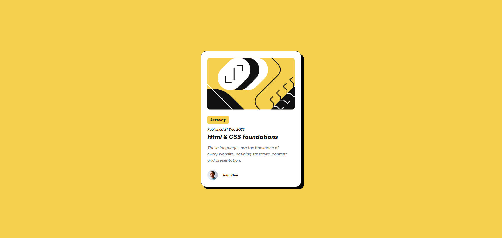

# Blog Preview Card

This interface began life as a polished Figma artboard from Frontend Mentor, and every pixel you see here was **meticulously translated from that design into production-ready HTML and CSS**. The goal was to recreate the visual story of the mockup with code that feels just as intentional—typography, color, rhythm, and responsive breakpoints all intact.

## Screenshot



## Live Demo

Experience the component at the [Live Demo](https://mehmetulker.github.io/blog-preview-card/).

## Repository

Full source code lives at the [GitHub Repository](https://github.com/mehmetulker/blog-preview-card).

## Built With

- HTML5
- CSS3
  - CSS custom properties
  - `@font-face` for the FigTree typeface
  - Flexbox layout
  - Media queries for responsive behavior

## Run Locally

```bash
git clone https://github.com/mehmetulker/blog-preview-card.git
cd blog-preview-card
```

Open `index.html` in your browser to explore the build.

## From Figma to Front-End

- Extracted spacing, color tokens, and font scales directly from the Figma design system and mapped them to reusable CSS variables.
- Packaged the FigTree font files from the design handoff and registered them via `@font-face` to match the exact typography.
- Implemented the desktop-to-mobile layout shifts exactly as defined in the prototype so the card responds with the same cadence the designer specified.

## Implementation Notes

- **Hover interactions:** Accent color transitions mirror the prototype cues for card and button states.
- **Semantic structure:** Headings, descriptions, and metadata use meaningful HTML tags for accessibility.
- **Lean assets:** Only the assets required by the Figma board are shipped to keep the bundle lightweight.

## Contributing

Suggestions and improvements are welcome—please open an issue or submit a pull request.

## License

This project is licensed under the MIT License. See the [LICENSE](LICENSE) file for details.
